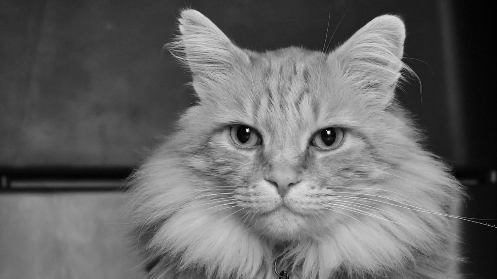

# JPEG-Compression-grayscale
This is an implementation of the JPEG compression algorithm for grayscale images.

In the jupyter notebook, I go step by step in the process of encoding and decoding. The notebook also offers a vectorized implementation of the Discrete Cosine Transform

### Demo: The HD image before compression

### The image after compression, with compressed stream length 1/10 the original size

On my local machine (i7-8550u), the compression takes from 4 to 5 seconds. This is also reported inside the notebook.

### Steps of the endocidng algorithm
* An image is divided into non-overlapping 8x8 blocks
* For each block, we calculate its corresponding **Discrete Cosine Transform (DCT)**, which is a real frequency domain representaion
* Natural images tend to occupy the low frequency region, as such, the DCT matrix is usually a sparse matrix
* We can make the DCT coefficient matrix more sparse, by dividing and rounding elemnetwise with a **qunatization table**, without severley affecting the visual quality of the image. As such, the quantization table offers a tradeoff between quality and the extent of compression
* We will then unroll every block into a 1D array. We can then leverage the matrix sparsity by first traversing the matrix in a ZigZag pattern, such that the zeros tend to form continuous sequences. These sequences can be compressed (lossless) using **Runlength code**
* The output of the Runlengh code is furhter compressed (lossless) using entropy code, where I used **Huffman code**
* The length of the final compressed stream is compared to the orignal stream, and thus we can compute the compression ratio

In order to decode the compressed stream, each step is reversed.

### File Organisation
* `src folder`: contains the source code. It contains `JPEG.ipynb`, which is the notebook itself, and `utils.py`, which is the code for Huffman encoding
* `images folder`: contains all images used in the notebook.
* `Original_HD_graysclae.jpeg`: The grayscale image before compreesion
* `Compressed_with_specs.jpeg`: The image after compression
